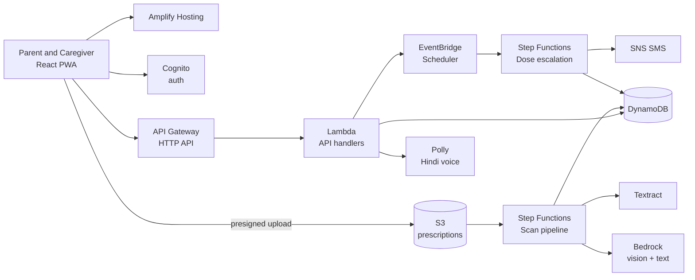

# DoseWise

**No pill is a mistake.**

Your parents take 7 pills a day from 3 doctors. DoseWise reads their
prescriptions, catches the same salt sold under two brand names, reminds them
by voice in Hindi, and tells you when a dose is missed.

Built for the First Commit hackathon. Fully serverless on AWS.

> DoseWise never changes a prescription. It flags things for a doctor or
> pharmacist to confirm. No diagnosis, no dosage advice, no interaction
> severity scores.

---

## Run it right now, with no AWS account

Everything works offline. The reading step replays a saved prescription
instead of calling Bedrock; every step after it is the real pipeline.

```bash
# terminal 1 - API (Python 3.9+, no dependencies at all)
python3 backend/local_server.py --port 4000 --demo

# terminal 2 - app
cd frontend && npm install && npm run dev
# open http://127.0.0.1:5173 and press "Load the demo family"
```

What to try, in order:

1. **Load the demo family** on the first screen. Seven medicines land, one
   duplicate salt is caught.
2. **Family tab**: the amber card says Dolo 650 and Calpol 650 both contain
   Paracetamol. Below it, the savings counter and Refill Radar.
3. **Parent tab**: the giant *ले लिया* button. Press it. Hindi praise plays
   through the browser's voice, and the toast offers Undo for five seconds.
4. **Reminder tab**: the full screen dose takeover, exactly as it appears on
   the parent's phone at 9 PM.
5. **Family tab → Run it** under "Try the escalation": reminder, wait, nudge,
   wait, family alert, mark missed, with 5 second waits. The SMS that would
   have been sent lands in a local outbox (`GET /outbox`).

Tests:

```bash
python3 backend/tests/test_core.py     # 68 checks: salts, duplicates, schedule, flow
cd frontend && node smoke.mjs          # browser checks (needs the two servers running)
```

---

## Architecture



Region: **ap-south-1 (Mumbai)**. Claude has no Mumbai-local foundation model:
it is reached from ap-south-1 through a **global cross-region inference
profile**, so `BEDROCK_MODEL_ID` carries a `global.` prefix and the Bedrock
console lists it under *Infer -> Inference profiles*, not in the Mumbai model
catalogue. Requests route across AWS commercial Regions, which also buys
headroom at peak. If that is ever unavailable, set `BEDROCK_REGION=us-east-1`
and use a plain regional model id instead.

### Two workflows carry the story

**Scan pipeline** (Express, `backend/statemachines/scan.asl.json`)

```
ExtractText -> AnyMedicinesFound? -> MatchSalts -> CheckDuplicates -> SaveDraft
                                         (any failure) -> ScanFailed
```

**Dose escalation** (Standard, `backend/statemachines/escalation.asl.json`)

```
SendReminder -> Wait -> CheckTaken -> taken? Done
                              |not taken
                            Nudge -> Wait -> CheckTaken -> taken? Done
                                                 |not taken
                                            AlertFamily -> MarkMissed -> Done
```

Express for scanning because it is short and billed per millisecond. Standard
for escalation because it waits up to an hour and Standard bills per state
transition, not per second of waiting.

### AI reads, code decides

Bedrock only converts a photograph into JSON. The salt lookup and the
duplicate check are plain Python over a dataset (`backend/common/salts.py`) —
deterministic, reproducible, and testable. That separation is the safety
claim, and it is what the tests cover.

### Service by service

| Service | Job | Why |
| --- | --- | --- |
| Amplify Hosting | React PWA on a public URL | git push deploys, free SSL |
| Cognito | Caregiver login; parents never type a password | managed auth |
| API Gateway (HTTP API) | REST endpoints, JWT authorizer | cheaper and faster than REST API |
| Lambda (Python 3.12, arm64) | All business logic | scales to zero |
| S3 | Prescription photos, visit card PDFs | presigned URLs, 30 day lifecycle rule on raw scans |
| Textract | Printed text, first cheap pass | cuts Bedrock tokens |
| Bedrock (Claude vision) | Handwriting to strict JSON | handles messy Indian prescriptions |
| Step Functions | Scan pipeline and dose escalation | judges read the graph instantly |
| EventBridge Scheduler | One recurring rule per medicine slot | native cron with time zones, no polling |
| SNS | SMS reminders and family alerts | simple, reliable |
| Polly (Aditi) | Hindi voice reminders | voice first for low literacy |
| DynamoDB | All app data, single table | pay per request, milliseconds |
| CloudWatch | Logs, alarms, one dashboard | shown in the video |

### Data model (single table `DoseWise`)

| PK | SK | Main attributes |
| --- | --- | --- |
| `FAMILY#id` | `PROFILE` | name, createdAt |
| `FAMILY#id` | `CAREGIVER#userId` | name, phone, role |
| `FAMILY#id` | `PARENT#parentId` | name, phone, language, timezone |
| `PARENT#parentId` | `MED#medId` | brand, salts[], strength, slots[], food, stripSize, status |
| `PARENT#parentId` | `SCAN#scanId` | s3Key, rawText, extractedJson, status |
| `PARENT#parentId` | `DOSE#date#slot#medId` | scheduledAt, status, takenAt |
| `PARENT#parentId` | `ALERT#timestamp` | type, message, read |
| `SALT#name` | `BRAND#brand` | generic name, Jan Aushadhi price, brand price |

GSI1 on phone number links a parent's device. TTL on `expiresAt` cleans up
scans and visit cards.

### API

| Method and path | What it does |
| --- | --- |
| `POST /families` | Create a family after signup |
| `POST /parents` | Add a parent |
| `POST /scans/upload-url` | Get a presigned S3 URL |
| `POST /scans/{id}/start` | Start the scan pipeline |
| `GET /scans/{id}` | Poll status and extracted medicines |
| `POST /meds/confirm` | Save reviewed medicines, create schedules |
| `GET /parents/{id}/today` | Today's slots with pill pictures |
| `POST /doses/{id}/taken` | Mark taken (idempotent) |
| `POST /doses/{id}/undo` | Undo, for the five second toast |
| `GET /parents/{id}/dashboard` | Adherence, alerts, refills, savings |
| `GET /parents/{id}/voice?slot=` | Polly audio URL for the reminder |
| `POST /parents/{id}/visit-card` | Generate the Doctor Visit Card PDF |

---

## Deploy to AWS

You need the AWS CLI and SAM CLI configured, plus Bedrock model access
granted in the console (request it first, it can take a while).

```bash
# 1. infrastructure
cd infra
sam build --template template.yaml
sam deploy --guided            # stack: dosewise-dev, region ap-south-1

# 2. load the medicine dataset into the table
DOSEWISE_BACKEND=aws TABLE_NAME=DoseWise-dev AWS_REGION=ap-south-1 \
  python3 data/load_dataset.py

# 3. point the frontend at the API and deploy
cd ../frontend
echo "VITE_API_BASE=$(aws cloudformation describe-stacks \
  --stack-name dosewise-dev --query \
  'Stacks[0].Outputs[?OutputKey==`ApiUrl`].OutputValue' --output text)" > .env.local
npm run build
# then connect the repo to Amplify Hosting, or: aws s3 sync dist/ s3://...
```

Before the event, also:

- Turn on MFA and set a **$20 billing alarm** (`AlarmEmail` parameter wires
  one up automatically).
- In SNS, check the SMS sandbox and add every demo phone number as a verified
  destination.
- `DemoMode=1` collapses the escalation waits to 30 seconds so the demo fits
  in a video.

### Environment variables

| Variable | Default | Notes |
| --- | --- | --- |
| `DOSEWISE_BACKEND` | `local` | `aws` switches DynamoDB, S3, SNS, Polly on |
| `TABLE_NAME` | `DoseWise` | |
| `BUCKET_NAME` | `dosewise-local` | |
| `BEDROCK_REGION` | `ap-south-1` | fall back to `us-east-1` |
| `BEDROCK_MODEL_ID` | `global.anthropic.claude-sonnet-4-5-...` | Global inference profile; `apac.` and bare ids fail from Mumbai |
| `DEMO_MODE` | `0` | `1` makes the waits 30 seconds |
| `MOCK_SCAN_FIXTURE` | `family_demo` | which sample prescription offline mode replays |

---

## Repository layout

```
dosewise/
  frontend/          React PWA (Parent Mode + Caregiver Mode)
  backend/
    common/          shared logic: store, salts, schedule, savings, voice, visit card
    functions/       one folder per Lambda
    statemachines/   scan.asl.json, escalation.asl.json
    prompts/         versioned extraction prompts
    tests/           test_core.py
    local_server.py  the whole API, offline, zero dependencies
  infra/             template.yaml (SAM), samconfig.toml
  data/              medicine dataset, loader, sample prescriptions
  docs/              learnings, dataset credits, design notes
```

## Security and privacy

- Encrypted at rest (S3 and DynamoDB, default KMS) and in transit.
- IAM least privilege per Lambda.
- Presigned upload URLs expire in 5 minutes; visit card links in 24 hours.
- Raw prescription images auto-delete after 30 days (S3 lifecycle rule).
- No data is used for training. This is stated in the app.

## Accessibility

- Hindi and English toggle on every screen.
- AAA contrast on parent screens; 22px base text, 32px headings.
- Every button at least 64px tall, full width, single tap. No long press, no
  swipe, no double tap anywhere.
- Screen reader labels on every control; the layout survives a 200 percent
  system font size (checked in `frontend/smoke.mjs`).
- Every parent screen has a speaker button that reads it aloud.

## Credits

Medicine dataset: see `docs/DATASET.md`. Check each source's licence before
shipping.
